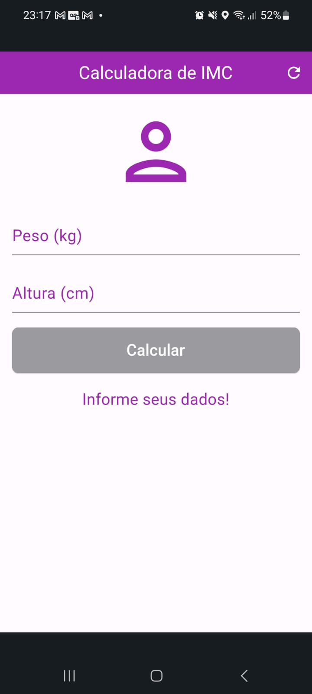
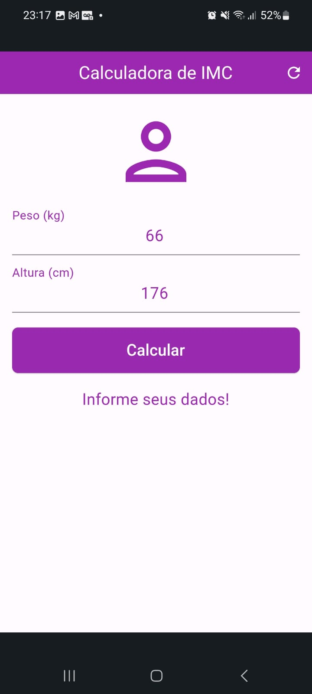
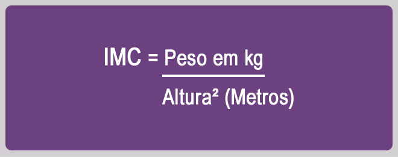
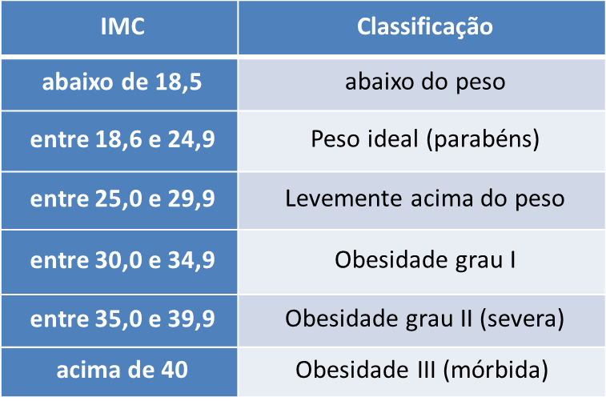
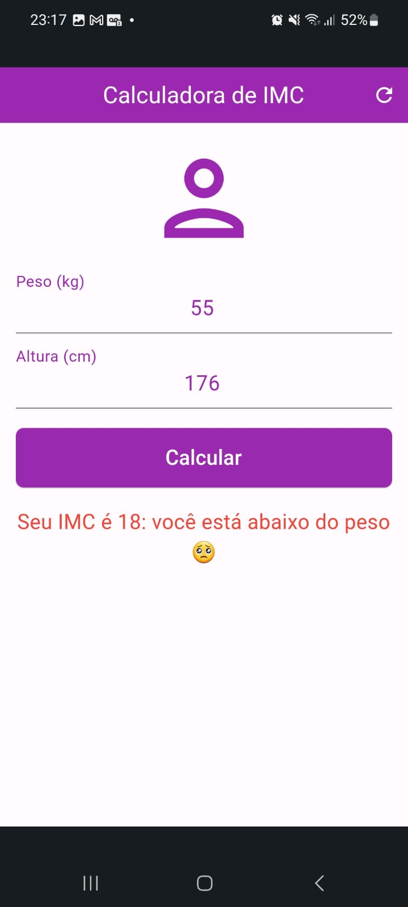
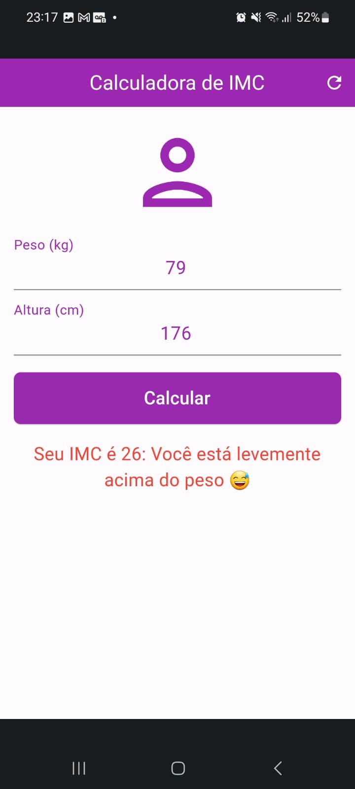
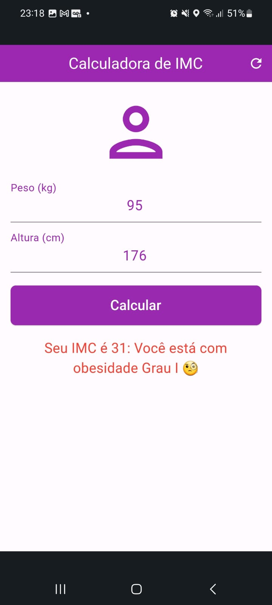
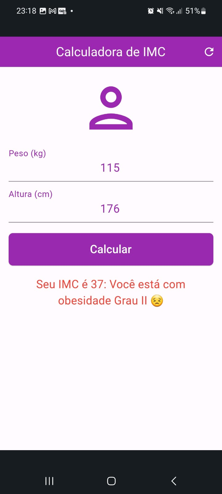
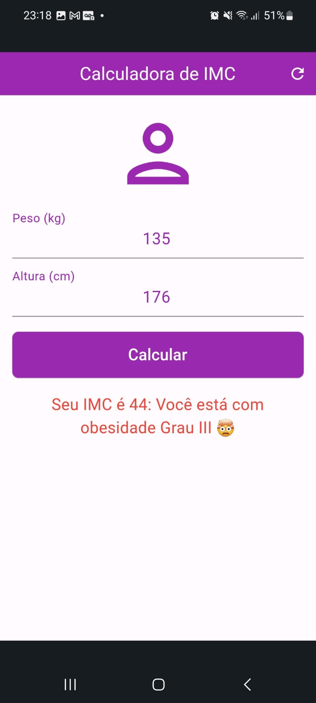

# Calculadora de IMC

**Esse é um aplicativo de uma calculadora de IMC (Índice de Massa Corporal) em Flutter!**

### APRESENTAÇÃO

Esse aplicativo foi desenvolvido em [Flutter](https://www.treinaweb.com.br/blog/o-que-e-flutter#:~:text=O%20Flutter%20%C3%A9%20atualmente%20um,de%20um%20%C3%BAnico%20c%C3%B3digo%20base.), utilizando a [linguagem Dart](https://www.hostinger.com.br/tutoriais/linguagem-dart#:~:text=Dart%20%C3%A9%20uma%20linguagem%20de,do%20cliente%20quanto%20no%20servidor.).

O objetivo desta aplicação é possibilitar ao usuário inserir suas medidas de altura (em cm) e peso (em kg) e obter seu índice de massa corporal, o [IMC](https://www.tjdft.jus.br/informacoes/programas-projetos-e-acoes/pro-vida/dicas-de-saude/pilulas-de-saude/o-que-o-indice-de-massa-corporal-imc-diz-sobre-sua-saude#:~:text=Criado%20no%20s%C3%A9culo%2019%20pelo,n%C3%A3o%20com%20o%20peso%20ideal.).

Junto do resultado do cálculo do IMC será exibida uma mensagem personalizada para cada caso.

---

## DOWNLOAD DO APP PARA ANDROID E IOS:

**O download do apk pode ser realizado através do link abaixo.**

# [BAIXAR APK](https://drive.google.com/file/d/16XfcTbijai91oRRKwTJ_8XuMWePI1ScZ/view?usp=sharing)

### TELA INICIAL DO APP

A tela inicial apresenta os campos de texto para inserção do peso e altura do usuário. O botão de "Calcular" só é habilitado caso o usuário digitar dados para os dois campos de texto.

  

---

### TELAS COM DADOS INSERIDOS

Ao inserir dados de altura e peso, o botão "Calcular" é ativado.

  

---

### TELA COM O RESULTADO DO IMC CALCULADO

Após clicar em "Calcular", o aplicativo calcula o índice de massa corporal com as informações do usuário, e esse resultado é exibido na tela com uma mensagem correspondente.

### O cálculo do IMC toma como base a fórmula:

  

### Utilizando essa fórmula, os seguintes resultados são possíveis:

  

**Com base nos dados acima, tem-se as seguintes telas de resultado no aplicativo:**

## TELA DE PESO IDEAL:

  

## TELA DE PESO ABAIXO DO IDEAL:

  

## TELA DE PESO ACIMA DO IDEAL:

  

## TELA DE OBESIDADE GRAU I:

  

## TELA DE OBESIDADE GRAU II:

  

## TELA DE OBESIDADE GRAU III:

  

   
   

### Desenvolvido com ❤️ por João Lucas

